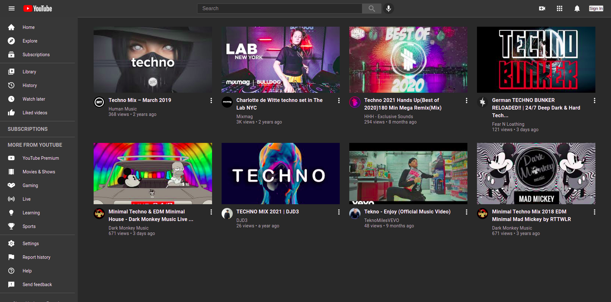

<h1 align='center'>YouTube Clone</h1>
</br>
<p>YouTube clone is a replica made by me from scratch of the well known online video sharing and social networking platform. </p>
</br>


<!-- TABLE OF CONTENTS -->
<details open="open">
  <summary>Table of Contents</summary>
  <ol>
    <li>
      <a href="#about-the-project">About The Project</a>
      <ul>
        <li><a href="#built-with">Built With</a></li>
      </ul>
    </li>
    <li>
      <a href="#getting-started">Getting Started</a>
      <ul>
        <li><a href="#prerequisites">Prerequisites</a></li>
        <li><a href="#installation">Installation</a></li>
      </ul>
    </li>
    <!-- <li><a href="#usage">Usage</a></li> -->
    <li><a href="#roadmap">Roadmap</a></li>
    <li><a href="#contributing">Contributing</a></li>
    <li><a href="#license">License</a></li>
    <li><a href="#contact">Contact</a></li>
    <li><a href="#acknowledgements">Acknowledgements</a></li>
  </ol>
</details>


<!-- ABOUT THE PROJECT -->
## About The Project

<p>This project was built with the aim to challenge myself, to keep practicing and learning by doing.
It contains the same basic functions as the original site, such as searching for videos, playing them or adding them to the "watch later" list.</p>



### Built With

<a href="https://reactjs.org" target="_blank">
  
</a>
<a href="https://sass-lang.com">
  
</a>


<!-- GETTING STARTED -->
## Getting Started

To get a local copy up and running follow these simple example steps.

### Prerequisites

* npm
  ```sh
  npm install npm@latest -g
  ```

### Installation

1. Get a free API Key at [YouTube Data API](https://developers.google.com/youtube/v3/)
2. Clone the repo
   ```sh
   git clone https://github.com/Lnferrari/youtube-clone.git
   ```
3. Install NPM packages
   ```sh
   npm install
   ```
4. Enter your API in `/client/.env`
   ```JS
   const REACT_APP_API_KEY = 'ENTER YOUR API';
   ```


<!-- USAGE EXAMPLES -->
<!-- ## Usage

Use this space to show useful examples of how a project can be used. Additional screenshots, code examples and demos work well in this space. You may also link to more resources.

_For more examples, please refer to the [Documentation](https://documentation.com)_ -->


<!-- ROADMAP -->
## Roadmap

See the [open issues](https://github.com/Lnferrari/youtube-clone/issues) for a list of proposed features (and known issues).


<!-- CONTRIBUTING -->
## Contributing

Contributions are what make the open source community such an amazing place to learn, inspire, and create. Any contributions you make are **greatly appreciated**.

1. Fork the Project
2. Create your Feature Branch (`git checkout -b feature/AmazingFeature`)
3. Commit your Changes (`git commit -m 'Add some AmazingFeature'`)
4. Push to the Branch (`git push origin feature/AmazingFeature`)
5. Open a Pull Request


<!-- LICENSE -->
## License

Distributed under the MIT License.


<!-- CONTACT -->
## Contact

Lucas Ferrari - [Linkedin](https://twitter.com/your_username) - ln.ferrari@hotmail.com

Project Link: [https://github.com/Lnferrari/youtube-clone](https://github.com/Lnferrari/youtube-clone)


<!-- ACKNOWLEDGEMENTS -->
## Acknowledgements
* [React Router DOM](https://reactrouter.com/)
* [axios](https://axios-http.com/)
* [React Tooltip](https://wwayne.github.io/react-tooltip/)
* [React Icons](https://react-icons.github.io/react-icons/)
* [Momentjs](https://momentjs.com/)
* [GitHub Pages](https://pages.github.com)


<!-- MARKDOWN LINKS & IMAGES -->

